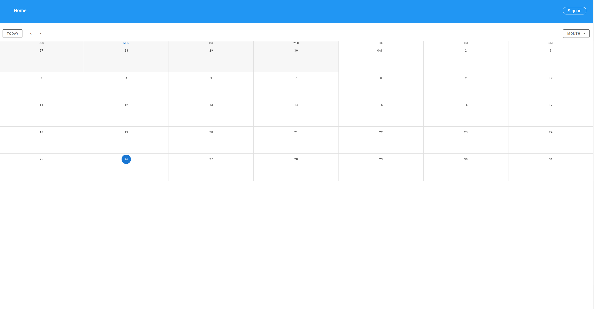

# EasyMeet


## Overview
**This project is made for the *Individual software project* course available on Blekinge Tekniska Högskola.**

EasyMeet is an app that makes scheduling meetings easier. It utilizes the Microsoft Authentication Library to make it possible to sign in with your Microsoft account, Microsoft Graph API to show/create Microsoft calendar events, Vue.js + a Vuetify calendar component to display signed in users microsoft events and Google Firebase to store created dates for the poll-voting system.

**A microsoft account is needed to use the application.**

## Features
1. Log in with microsoft account
2. See personal microsoft calendar events in the app calendar
3. A voting system where the organizer can add dates and let other users vote for their preferable date.
4. Create new events that are synced to your microsoft account with the possibility to invite other people.

## Project setup
**Make sure that you have node and npm installed**

The commands below are based on Linux(debian). Change the commands accordingly if you're using another system.

Open up your terminal and do the following:
```
# clone the repo
git clone https://github.com/MartinLindstroem/vue-meeting-scheduler.git

# Go to the directory
cd vue-meeting-scheduler

# Install dependencies
npm install

# Copy the config-sample.js file
cp src/plugins/config-sample.js src/plugins/config.js
```

* Next open your text editor of choice and change the values in `src/plugins/config.js` to your own values (guide further down on how to get your own values)

* After that make sure that you are in the root directory and run the command `npm run serve` to start the server

* Go to `http://localhost:8080`

## Setting up Firebase
1. Go to https://firebase.google.com/ and log in
2. In the upper right corner press `Go to console`
3. Add project
4. In the project overview below the text `Get started by adding Firebase to your app` press the `web` button and register your app.
5. Copy the values in the `firebaseConfig` object and paste them in `src/plugins/config.js`
```
const firebaseConfig = {
  apiKey: "your-api-key",
  authDomain: "your-auth-domain",
  databaseURL: "your-database-url",
  projectId: "your-project-id",
  storageBucket: "your-storage-bucket",
  messagingSenderId: "your-messaging-sender-id",
  appId: "your-app-id"
}
```
6. Go to `Cloud Firestore` and create a database

## Registering application
To be able to authenticate users with microsoft you need to register your application

1. Go to https://aad.portal.azure.com/ and sign in with your microsoft account
2. Go to **Azure Active Directory** in the menu to the left and select **App registrations**
3. Select **New registration** and enter a name, set **Supported account types** to **Accounts in any organizational directory and personal Microsoft accounts**
4. Under **redirect URI**, set the first drop-down to **Single-page application (SPA)** and set the value to *http://localhost:8080*
5. Choose **Register** and copy your **Program-ID(client)**
6. As stated in the **project setup** at the start of this README, change the client ID to your own in `src/plugins/config.js` 
```
const msalConfig = {
    auth: {
        clientId: 'your-client-id',
        redirectUri: 'http://localhost:8080'
    }
};
```
